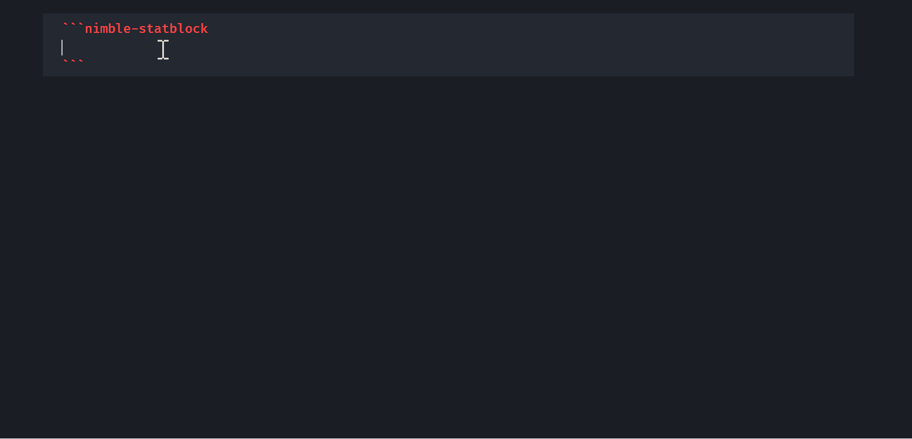

# Nimble Statblock

Render Nimble 2 monster statblocks directly inside Obsidian.

This plugin fetches monster data from Nimble Nexus and displays it using the familiar Nimble 2 statblock layout.

## Example

Create a code block containing a Nimble monster ID from Nimble Nexus:

```nimble-statblock
titan-of-the-deep-woods-058mvwfe338kr8t8czqvgwadda
```

The plugin will automatically fetch the monster and render a complete statblock.

### Screenshot




## Installation

### Manual Installation

Download the following files from the latest release:

* `main.js`
* `manifest.json`
* `styles.css`

Create the folder:

```text
<vault>/.obsidian/plugins/nimble-statblock/
```

Copy the files into that folder and restart Obsidian (or reload Community Plugins).

Then enable **Nimble Statblock** from:

```text
Settings → Community Plugins
```

### Install via BRAT

1. Install the **BRAT** plugin.
2. Open BRAT settings.
3. Select **Add Beta Plugin**.
4. Enter the URL of this repository.
5. Install and enable the plugin.

## Usage

Insert a code block containing a Nimble Nexus monster ID:

```nimble-statblock
monster-id
```

### Finding the Monster ID

The monster ID is the last part of the monster's URL on Nimble Nexus.

For example, the monster **Titan of the Deep Woods** is located at:

```text
https://nimble.nexus/monsters/titan-of-the-deep-woods-058mvwfe338kr8t8czqvgwadda
```

Therefore, the monster ID is:

```text
titan-of-the-deep-woods-058mvwfe338kr8t8czqvgwadda
```

And the corresponding code block would be:

```nimble-statblock
titan-of-the-deep-woods-058mvwfe338kr8t8czqvgwadda
```

The plugin will fetch the corresponding monster data from Nimble Nexus and render the resulting statblock directly inside your note.

## License

This project is open source and released under the MIT License. You are free to use, modify, and distribute it in accordance with the terms of that license.

This repository contains only the source code for the plugin. Monster data is retrieved at runtime from external services and is not distributed as part of this project.
